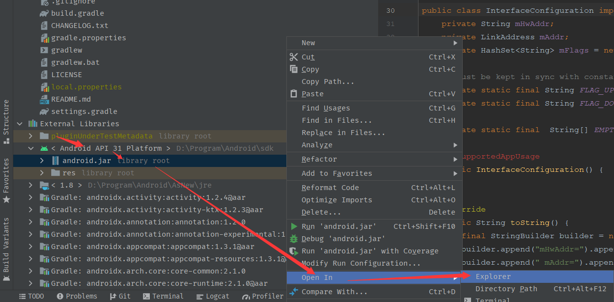
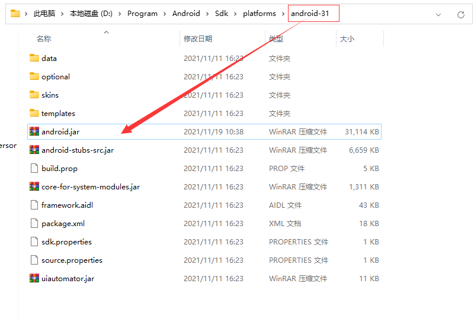

# aosp-android-jar

# jar包使用方法：

替换 `${Android Sdk}/platforms/andorid-api/`  下的android.jar，之后sync一下。





[针对非 SDK 接口的限制说明](https://developer.android.google.cn/distribute/best-practices/develop/restrictions-non-sdk-interfaces?authuser=0)


#### 有以下情况需要说明一下：

- 能调用到不代表可以调用，例如黑名单api还是会受到上面限制

- 如果你是系统应用，或者有root权限可以无视以上限制

- Android.jar的接口和当前AOSP接口保持一致，但是部分类会做修改，修改是添加旧系统接口，修改会添加在对应Jar包目录说明中,需要简短适配,例如：
```
 final IPackageInstaller iPackageInstaller = AppGlobals.getPackageManager().getPackageInstaller();
            if (Build.VERSION.SDK_INT >= Build.VERSION_CODES.S) {
                packageInstaller = new PackageInstaller(iPackageInstaller, null, null, UserHandle.myUserId());
            } else {
                packageInstaller = new PackageInstaller(iPackageInstaller, null, UserHandle.myUserId());
            }
```
- 部分新版sdk接口的返回值可能和旧版sdk接口不同，那么如果不接收返回值，则可能导致编译正常运行报错，这种情况需要判断使用反射形式调用，例如:
```
//此方法在api29和28之前返回值不同
lockPatternUtils.saveLockPassword(it, null, DevicePolicyManager.PASSWORD_QUALITY_COMPLEX, UserHandle.myUserId())
```

#### 使用这种方式有什么好处：
- 有调用提示，方法列表可以点出来

- 减少适配成本，版本更新之后，不适配的方法会直接以错误的形式体现出来，不会如反射一样直接编译通过而运行时报错

- 无意中会学会更多知识，列出方法列表会更加接近源码，偶尔留下的印象也许会在某天突然融会贯通

## License
```text
MIT License

Copyright (c) 2020 鼎鼎鼎

Permission is hereby granted, free of charge, to any person obtaining a copy
of this software and associated documentation files (the "Software"), to deal
in the Software without restriction, including without limitation the rights
to use, copy, modify, merge, publish, distribute, sublicense, and/or sell
copies of the Software, and to permit persons to whom the Software is
furnished to do so, subject to the following conditions:

The above copyright notice and this permission notice shall be included in all
copies or substantial portions of the Software.

THE SOFTWARE IS PROVIDED "AS IS", WITHOUT WARRANTY OF ANY KIND, EXPRESS OR
IMPLIED, INCLUDING BUT NOT LIMITED TO THE WARRANTIES OF MERCHANTABILITY,
FITNESS FOR A PARTICULAR PURPOSE AND NONINFRINGEMENT. IN NO EVENT SHALL THE
AUTHORS OR COPYRIGHT HOLDERS BE LIABLE FOR ANY CLAIM, DAMAGES OR OTHER
LIABILITY, WHETHER IN AN ACTION OF CONTRACT, TORT OR OTHERWISE, ARISING FROM,
OUT OF OR IN CONNECTION WITH THE SOFTWARE OR THE USE OR OTHER DEALINGS IN THE
SOFTWARE.


```
